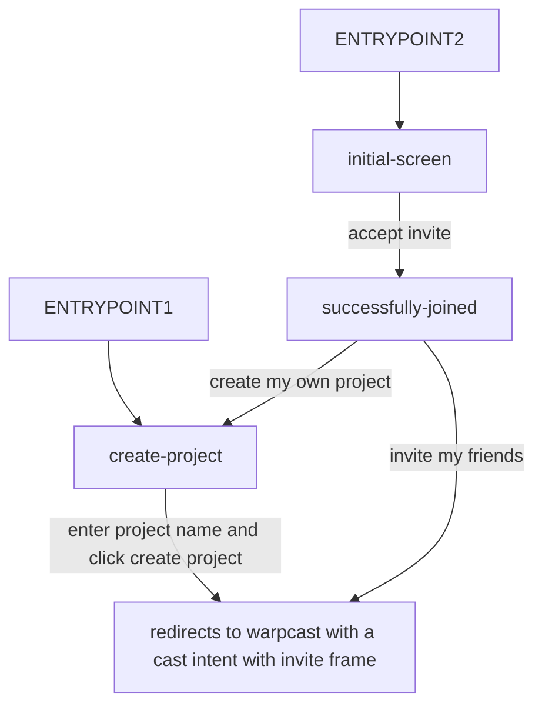

# Referral Frame

Referrals on Farcaster using frames

## How it works
- Create a project
- Issue an invite frame and share it on Farcaster
- People can accept the invite, and create their own frames to share

## Notes
- this is centralized: referrals, project names, and signed up users are stored in a centralized database
- on Cloudflare Worker + D1 - was trying out an alternative to nextjs
